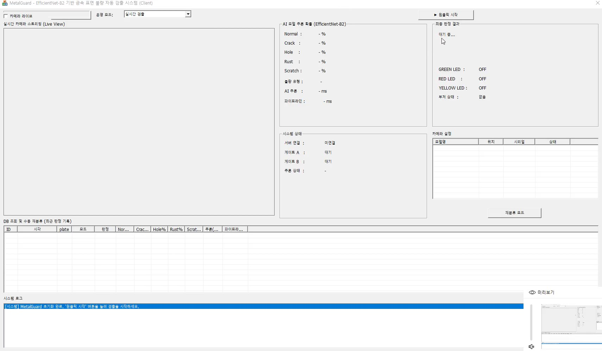
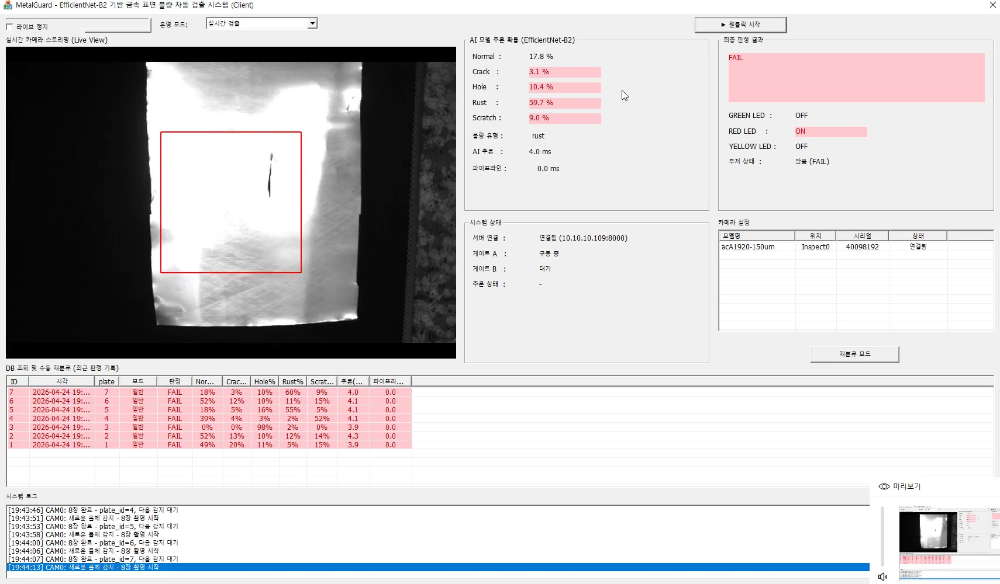
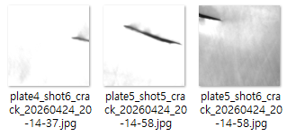
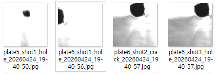
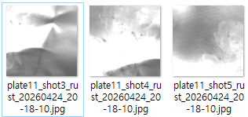
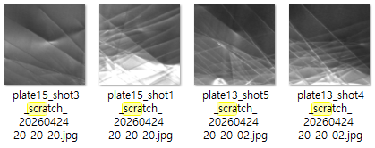
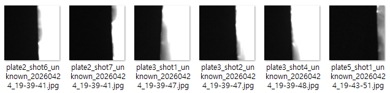

# 🔩 MetalGuard - 금속 표면 불량 자동 검출 시스템

> EfficientNet-B2 기반 컨베이어 벨트 금속판 표면 불량 자동 검출 시스템

---

## 📌 프로젝트 개요

공장 컨베이어 벨트 위를 지나가는 금속판을 카메라로 촬영하여
AI 모델이 표면 불량을 실시간으로 검출하고 **PASS / FAIL / UNCERTAIN** 3단계로 자동 판정하는 시스템입니다.

| 항목 | 내용 |
|------|------|
| 기간 | 2026. 04. 13 ~ 04. 25 (13일) |
| 모델 | EfficientNet-B2 |
| 데이터셋 | Kaggle — Synthetic Industrial Metal Surface Defects (15,000장, 5클래스) |
| 판정 | PASS / FAIL / UNCERTAIN |
| 불량 클래스 | normal / crack / hole / rust / scratch |
| 파이프라인 목표 | 철판 1개당 2000ms 이내 |
| 실제 소요시간 | 약 15ms |

---

## 👥 팀 구성

| 이름 | 담당 | IP / 포트 |
|------|------|-----------|
| 이지나 | 운용 서버 (Python) | 10.10.10.109 / 8000 |
| 김범준 | AI 서버 (Python) + 모델 학습 | 10.10.10.128 / 9000 |
| 김민기 | 카메라 + MFC 클라이언트 (C++) | → 8000 연결 |
| 김희창 | 아두이노 PC (C++ 콘솔) | → 8000 연결 |

---

## 🖥️ 시스템 화면

| 대기 중 | 판정 진행 중 |
|--------|------------|
|  |  |

---

## 🏗️ 시스템 아키텍처

```
[Basler GigE 카메라]
        │ Pylon SDK
        ▼
[카메라+MFC 클라이언트 (C++)] ──────────────────── 10.10.10.xxx
        │ TCP 8000 (IMG_SEND / IMG_RECLASSIFY)
        ▼
[운용 서버 (Python)] ────────────────────────────▶ [MariaDB]
  10.10.10.109:8000                                 10.10.10.101:3306
        │ TCP 9000 (INFER_REQ / INFER_RES)
        ▼
[AI 서버 (Python)]
  10.10.10.128:9000
  EfficientNet-B2 추론 (4~5ms)

[운용 서버] ────────────────────────────────────▶ [아두이노 PC (C++)]
           TCP 8000 (VERDICT_PASS/FAIL/UNCERTAIN)   → 아두이노 시리얼 전달

[운용 서버] ────────────────────────────────────▶ [MFC 클라이언트]
           TCP 8000 (RESULT_SEND)                   판정 결과 UI 표시
```

---

## 📁 프로젝트 구조

```
MetalGuard/
├── README.md                 # 팀 전체 통합 README (현재 파일)
├── assets/                   # 이미지 리소스
├── operation_server/         # 운용 서버 (이지나)
│   ├── README.md
│   ├── main.py
│   ├── config.py
│   ├── constants.py
│   ├── test_ai.py
│   ├── test_db.py
│   └── server/
│       ├── tcp_server.py
│       ├── handlers/
│       ├── engine/
│       └── db/
├── ai_server/                # AI 서버 + 모델 학습 (김범준)
│   ├── README.md
│   ├── ai_server.py
│   ├── train.py
│   ├── model.py
│   ├── dataset.py
│   ├── evaluate.py
│   ├── gradcam.py
│   ├── tta.py
│   └── temperature_scaling.py
├── camera_mfc/               # 카메라 + MFC 클라이언트 (김민기)
│   ├── README.md
│   ├── CameraManager.cpp/h
│   ├── PylonSampleProgramDlg.cpp/h
│   └── ...
└── arduino/                  # 아두이노 브리지 (김희창)
    ├── README.md
    ├── MetalGuard/           # 아두이노 펌웨어
    ├── MetalGuardTerminal/   # 브리지 콘솔 버전
    └── MetalGuardUI/         # 브리지 MFC GUI 버전
```

---

## 📡 통신 프로토콜

### PacketHeader 구조 (8바이트 고정)

```
[2B: signature(0x4D47)] + [2B: cmdId] + [4B: bodySize] + [JSON 바디]
이미지 포함 시: 위 구조 + [4B: 이미지크기] + [이미지 바이트]
```

### CmdID 목록

| CmdID | 값 | 방향 | 설명 |
|-------|----|------|------|
| IMG_SEND | 1 | 카메라 → 운용서버 | 촬영 이미지 전송 (첫 분류) |
| IMG_RECLASSIFY | 2 | 카메라 → 운용서버 | 재분류 이미지 전송 |
| INFER_REQ | 101 | 운용서버 → AI서버 | 추론 요청 |
| INFER_RES | 102 | AI서버 → 운용서버 | 추론 결과 |
| VERDICT_PASS | 201 | 운용서버 → 아두이노PC | 정상 판정 |
| VERDICT_FAIL | 202 | 운용서버 → 아두이노PC | 불량 판정 |
| VERDICT_UNCERTAIN | 203 | 운용서버 → 아두이노PC | 미분류 판정 |
| DONE_PASS | 205 | 아두이노PC → 운용서버 | PASS 동작 완료 |
| DONE_FAIL | 206 | 아두이노PC → 운용서버 | FAIL 서보모터 동작 완료 |
| DONE_UNCERTAIN | 207 | 아두이노PC → 운용서버 | UNCERTAIN 서보모터 동작 완료 |
| RESULT_SEND | 301 | 운용서버 → MFC | 판정 결과 전송 |
| PING | 501 | 아두이노PC → 운용서버 | 연결 등록 |
| PONG | 502 | 운용서버 → 아두이노PC | 연결 등록 응답 |
| ERROR_RES | 503 | 운용서버 → 클라이언트 | 에러 응답 |

---

## 🔄 판정 흐름

```
1. 카메라가 프레임 차분으로 철판 진입 감지
2. 0.25초 간격으로 8장 촬영 → 운용서버로 순차 전송
3. 운용서버: 장별 AI 추론 → plate_id별 PlateBuffer에 결과 누적
4. 8장 완료 시 종합 판정
   - FAIL 2장 이상 → FAIL
   - FAIL 0장 + UNCERTAIN 2장 이상 → UNCERTAIN
   - 나머지 → PASS
5. 아두이노PC에 TCP로 VERDICT 패킷 전송
6. MFC에 RESULT_SEND 전송 (확률값 포함)
7. DB 저장 (inspection_result)
```

### 첫 분류 vs 재분류

| 판정 | 첫 분류 | 재분류 |
|------|--------|--------|
| PASS | 통과 | 통과 |
| FAIL | 게이트 A (폐기) | 게이트 A (폐기) |
| UNCERTAIN | 게이트 B (재분류 라인) | FAIL로 처리 → 게이트 A |

---

## ⚙️ 판정 임계값

| 판정 | 조건 |
|------|------|
| PASS | `prob_normal ≥ 0.65` |
| UNCERTAIN | `max_prob < 0.40` |
| FAIL | 위 두 조건 모두 해당 없음 |

---

## 🧠 AI 모델 성능

| 지표 | 목표 | 실제 |
|------|------|------|
| Recall (불량 검출률) | ≥ 0.90 | **0.9946** ✅ |
| AUROC | ≥ 0.85 | **0.9999** ✅ |
| F1-Score | ≥ 0.82 | **0.9953** ✅ |
| Precision | ≥ 0.75 | **0.9954** ✅ |

### 추론 속도

| 구간 | 최적화 전 | 최적화 후 |
|------|----------|----------|
| 첫 번째 요청 | 20,000ms | **7.5ms** |
| 연속 요청 | 8~16ms | **4~5ms** |

---

## 🔍 불량 클래스 예시

| crack | hole | rust | scratch | unknown |
|-------|------|------|---------|---------|
|  |  |  |  |  |

---

## 🗄️ DB 스키마

| 테이블 | 설명 |
|--------|------|
| `model_version` | AI 모델 버전 관리 |
| `inspection_result` | 판정 결과 (장별 1행) |
| `pipeline_log` | 파이프라인 구간별 지연시간 로그 |

---

## 📋 개발 환경

| 파트 | 환경 |
|------|------|
| 운용 서버 | Ubuntu 22.04 (WSL2) / Python 3.11 / VS Code |
| AI 서버 | Python 3.12 / PyTorch 2.x / CUDA / NVIDIA RTX 5090 |
| 카메라+MFC | Windows / C++ / Visual Studio 2022 / Pylon SDK / OpenCV 4.x |
| 아두이노 | Windows / C++ / Visual Studio / Serial 9600 baud |
| DB | MariaDB |

---

## 📂 각 파트별 상세 README

- [운용 서버 README](operation_server/README.md)
- [AI 서버 README](ai_server/README.md)
- [카메라+MFC README](camera_mfc/README.md)
- [아두이노 README](arduino/README.md)