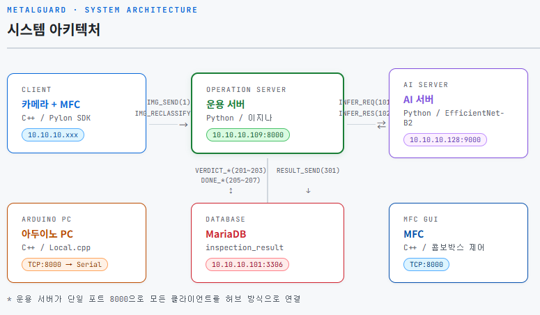
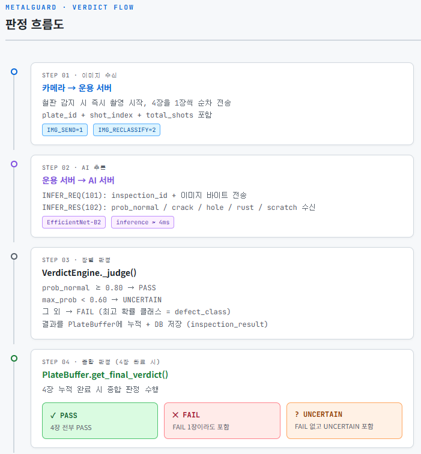
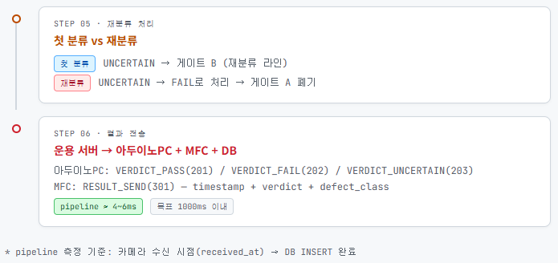

# 🖥️ MetalGuard - 운용 서버 (이지나)

> MetalGuard 프로젝트에서 운용 서버(Python) 파트를 담당합니다.
> 카메라-AI서버-아두이노-MFC-DB를 연결하는 중앙 허브 역할입니다.

---

## 📁 파일 구조 및 역할

```
metal_guard_server/
├── main.py               # 서버 진입점. DB/AI/TCP/판정엔진 순서대로 초기화 후 시그널 대기
├── config.py             # 전체 설정값 (IP, 포트, 임계값 등). 코드 수정 없이 여기서만 변경
├── constants.py          # PacketHeader 상수, CmdID 정의, build_packet/parse_header 유틸
└── server/
    ├── tcp_server.py          # 단일 포트(8000) TCP 서버. cmdId로 분기하여 각 핸들러 호출
    ├── handlers/
    │   ├── camera_handler.py  # 이미지 수신 → ImageTask 생성 → Queue 적재
    │   ├── ai_client.py       # AI 서버 TCP 통신. INFER_REQ 전송 / INFER_RES 수신
    │   └── mfc_handler.py     # MFC로 RESULT_SEND(301) 패킷 전송
    ├── engine/
    │   └── verdict_engine.py  # Queue 소비 → AI 추론 → 장별 판정 → PlateBuffer 누적 → 종합 판정 → 전송
    └── db/
        └── db_manager.py      # inspection_result / pipeline_log INSERT. 재연결 로직 포함
```

---

## 🔄 서버 초기화 순서 (`main.py`)

판정 엔진이 먼저 준비된 뒤 TCP 서버를 열어야 이미지 유실이 없음.

```
1. DB 연결        (DBManager.connect)
2. AI 서버 연결   (AIClient.connect)
3. TCP 서버 준비  (TCPServer 인스턴스 생성, start는 아직 X)
4. 판정 엔진 시작 (VerdictEngine.start → 별도 쓰레드)
5. TCP 서버 시작  (TCPServer.start → 별도 쓰레드)
6. 시그널 등록    (SIGINT / SIGTERM → graceful shutdown)
7. signal.pause() 로 메인 쓰레드 대기
```

---

## 📡 통신 프로토콜

### PacketHeader 구조 (8바이트 고정)

```
[2B: signature(0x4D47)] + [2B: cmdId] + [4B: bodySize] + [JSON 바디]
이미지 포함 시: 위 구조 + [4B: 이미지크기] + [이미지 바이트]
```

### CmdID 전체 목록

| CmdID | 값 | 방향 | 설명 |
|-------|----|------|------|
| IMG_SEND | 1 | 카메라 → 운용서버 | 촬영 이미지 전송 (첫 분류) |
| IMG_RECLASSIFY | 2 | 카메라 → 운용서버 | 재분류 이미지 전송 |
| INFER_REQ | 101 | 운용서버 → AI서버 | 추론 요청 |
| INFER_RES | 102 | AI서버 → 운용서버 | 추론 결과 |
| VERDICT_PASS | 201 | 운용서버 → 아두이노PC | 정상 판정 |
| VERDICT_FAIL | 202 | 운용서버 → 아두이노PC | 불량 판정 |
| VERDICT_UNCERTAIN | 203 | 운용서버 → 아두이노PC | 미분류 판정 |
| DONE_PASS | 205 | 아두이노PC → 운용서버 | PASS 동작 완료 |
| DONE_FAIL | 206 | 아두이노PC → 운용서버 | FAIL 서보모터 동작 완료 |
| DONE_UNCERTAIN | 207 | 아두이노PC → 운용서버 | UNCERTAIN 서보모터 동작 완료 |
| RESULT_SEND | 301 | 운용서버 → MFC | 판정 결과 전송 |
| PING | 501 | 아두이노PC → 운용서버 | 연결 등록 |
| PONG | 502 | 운용서버 → 아두이노PC | 연결 등록 응답 |
| ERROR_RES | 503 | 운용서버 → 클라이언트 | 에러 응답 |

### JSON 바디 상세

**IMG_SEND(1) / IMG_RECLASSIFY(2)**
```json
{
  "client_id": "cam_01",
  "timestamp": "2026-04-21 14:23:01",
  "plate_id": 1,
  "shot_index": 1,
  "total_shots": 8
}
```

**INFER_REQ(101)** — JSON 바디 뒤에 `[4B: 이미지크기] + [이미지 바이트]` 추가
```json
{ "inspection_id": 1042 }
```

**INFER_RES(102)**
```json
{
  "inspection_id": 1042,
  "prob_normal": 0.02,
  "prob_crack": 0.88,
  "prob_hole": 0.05,
  "prob_rust": 0.03,
  "prob_scratch": 0.02,
  "inference_ms": 8.5,
  "model_version_id": 3
}
```

**RESULT_SEND(301)**
```json
{
  "timestamp": "...",
  "verdict": "PASS",
  "defect_class": "normal",
  "prob_normal": 0.5256,
  "prob_crack": 0.1807,
  "prob_hole": 0.0997,
  "prob_rust": 0.0906,
  "prob_scratch": 0.1033,
  "inference_ms": 9.55,
  "plate_id": 1
}
```


---


## 🧠 판정 엔진 (`verdict_engine.py`)

### 장별 판정 흐름

```
Queue에서 ImageTask 꺼냄
    │
    ├─ AI 추론 (INFER_REQ → INFER_RES)
    ├─ 장별 판정 (_judge)
    ├─ DB 저장 (inspection_result INSERT)
    ├─ 로그 출력 (1줄 요약)
    └─ PlateBuffer에 누적
            │
            └─ total_shots 장 완료 시
                    ├─ 종합 판정 (get_final_verdict)
                    ├─ 아두이노PC TCP 전송 (VERDICT_PASS/FAIL/UNCERTAIN)
                    ├─ MFC TCP 전송 (RESULT_SEND)
                    └─ 버퍼 제거
```

### 장별 판정 임계값

| 판정 | 조건 |
|------|------|
| PASS | prob_normal ≥ 0.675 |
| UNCERTAIN | max_prob < 0.40 |
| FAIL | 위 두 조건 모두 해당 없음 |

### 종합 판정 로직

| 조건 | 종합 판정 |
|------|----------|
| FAIL 2장 이상 | FAIL |
| FAIL 0장 + UNCERTAIN 2장 이상 | UNCERTAIN |
| 나머지 | PASS |

### 첫 분류 vs 재분류

| 판정 | 첫 분류 (IMG_SEND=1) | 재분류 (IMG_RECLASSIFY=2) |
|------|---------------------|--------------------------|
| PASS | 통과 | 통과 |
| FAIL | 게이트 A (폐기) | 게이트 A (폐기) |
| UNCERTAIN | 게이트 B (재분류 라인) | FAIL로 처리 → 게이트 A |

> 재분류에서 UNCERTAIN이 나오면 운용 서버가 FAIL로 처리 (`get_final_verdict(is_reclassify=True)`)

### PlateBuffer 만료 처리

Queue가 비었을 때 주기적으로 `_cleanup_expired_buffers()` 호출.
`PLATE_BUFFER_EXPIRE_SEC = 6.0` 초 초과 시 모인 장수로 강제 종합 판정 후 버퍼 제거.

---


## 🏗️ 시스템 아키텍처



## 🔄 판정 흐름도





---


## 🔌 소켓 관리 (`tcp_server.py`)

단일 포트(8000)로 모든 클라이언트 연결 수락. 연결마다 별도 쓰레드 생성.

| 소켓 | 등록 시점 | 용도 |
|------|----------|------|
| `mfc_client_sock` | IMG_SEND 첫 수신 시 | RESULT_SEND 전송 |
| `arduino_client_sock` | PING(501) 수신 시 | VERDICT 패킷 전송 |

---

## 🗄️ DB (`db_manager.py`)

### 사용 테이블

| 테이블 | INSERT 시점 | 주요 컬럼 |
|--------|------------|----------|
| `inspection_result` | 장별 판정 완료 후 | verdict, defect_class, prob_*, inference_ms, pipeline_ms, plate_id, is_reclassify |
| `pipeline_log` | 정상 건 100건당 1건 샘플링 | inspection_id, inference_ms, total_ms |

### 재연결 로직

INSERT 실패 시 자동으로 재연결 후 1회 재시도. MariaDB `wait_timeout`(기본 8시간) 대응.

---

## ⚙️ 설정 (`config.py`)

| 항목 | 값 | 설명 |
|------|----|------|
| `SERVER_PORT` | 8000 | 운용 서버 단일 포트 |
| `AI_HOST` | 10.10.10.128 | 김범준 AI 서버 |
| `AI_PORT` | 9000 | AI 서버 포트 |
| `DB_HOST` | 10.10.10.101 | MariaDB |
| `PASS_THRESHOLD` | 0.65 | PASS 판정 임계값 |
| `UNCERTAIN_THRESHOLD` | 0.40 | UNCERTAIN 판정 임계값 |
| `PIPELINE_TIMEOUT_MS` | 2000 | 철판 단위 목표 시간 |
| `MODEL_VERSION_ID` | 3 | 현재 사용 중인 모델 버전 |
| `SEND_RESULT_TO_MFC` | True | False로 바꾸면 MFC 전송 스킵 |
| `SHOT_COUNT` | 8 | 철판 1개당 촬영 장수 |
| `PLATE_BUFFER_EXPIRE_SEC` | 6.0 | 버퍼 만료 시간 (초) |

---

## 🛠️ 실행

```bash
# 의존성 설치
pip install pymysql

# 실행
cd metal_guard_server
python main.py

# 종료
Ctrl+C
```

### DEBUG 로그 활성화

`main.py`의 아래 줄 주석 해제 시 `server.*` 패키지 전체 DEBUG 로그 출력.

```python
logging.getLogger("server").setLevel(logging.DEBUG)
```
